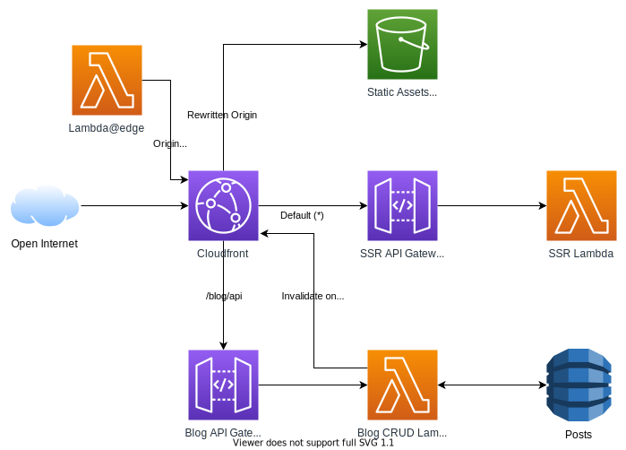

# JAMStack using SvelteKit and AWS

## Architecture

## SvelteKit options

- client side routing is disabled
- partial prerendered 
- partial SSR
- partial JavaScript
- JSON API endpoints

## AWS options

- Deployment via AWS-CDK
- CDN via CloudFront
- CDN static vs. SSR routing using AWS CloundFronts Lambda@Edge
- SSR via AWS API-Gateway (Proxy) and AWS Lambda
- Static + Prerendered Content via AWS S3